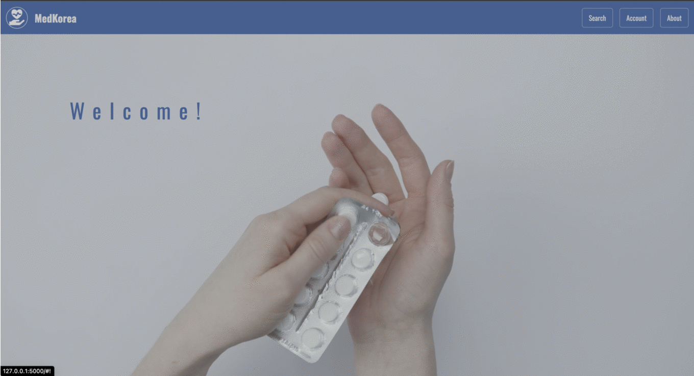

Project Name: MedKorea

---

About:

MedKorea is a comprehensive platform dedicated to providing reliable and accessible information about English-speaking medical professionals and facilities in South Korea.

Whether you're a tourist, student, or expat, navigating healthcare in a new country—especially with a language barrier—can be overwhelming. MedKorea helps bridge that gap with:

🌐 A landing page showcasing our services

🔍 A search page for doctors and facilities

📝 A registration page for creating accounts

📅 A booking page for scheduling appointments

👤 A user dashboard for managing bookings

⚙️ An admin page for backend operations

ℹ️ An about page outlining our mission

---

🔧 Technologies Used:

Frontend: HTML, CSS, JavaScript

Backend: Python with Flask (for server-side rendering)

Database: MariaDB

ORM: SQLAlchemy

Connection: pymysql

SQL Queries: Native SQL

Admin Interface: PHPMyAdmin

Environment: XAMPP (Apache, MariaDB, PHP, Perl)

---

Please check the **project_databases.py** + **project.sql** first or **database_project.py** file for creating the database schema.

-- We use HTML, CSS, and JavaScript for the frontend to create the user interface and user experience. 

-- Python with Flask is used for server-side rendering, providing dynamic content to the users. 

-- pymysql is used to connect to the MariaDB database. SQLAlchemy is used as an ORM to interact with the database. 

-- SQL language is employed for querying the database, and PHPMyAdmin serves as an administration interface for visual aid in database management.

---

How to Use:

1) Clone this repository to your local machine.

2) Set up the MariaDB database using the provided schema.

3) Configure the database connection in the Flask application.

4) Host the Flask application on a server.

5) Access the website through your preferred web browser.

6) Use PHPMyAdmin to visualize and manage the database.
